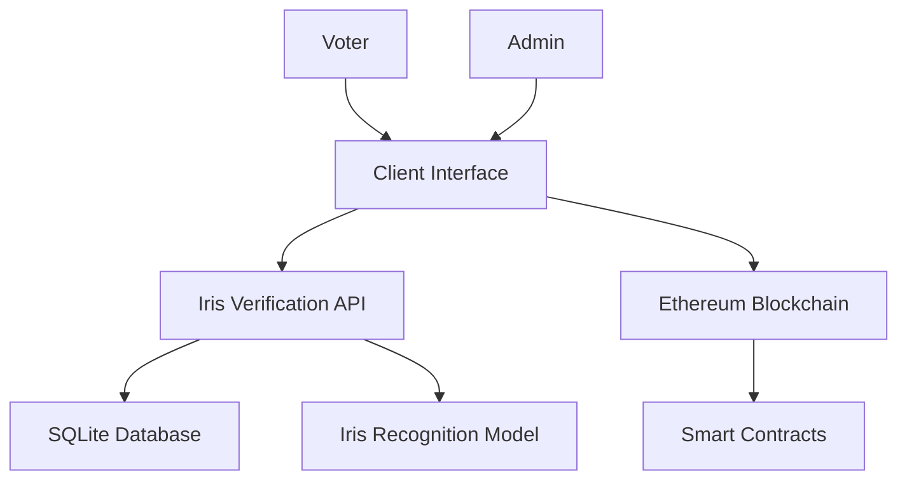

# IriVotechain- Blockchain-based Secure Voting with Iris Biometric Authentication


## Table of Contents
1. [Project Overview](#project-overview)
2. [Key Features](#key-features)
3. [System Architecture](#system-architecture)
4. [Technology Stack](#technology-stack)
5. [Installation Guide](#installation-guide)
6. [Usage Instructions](#usage-instructions)
7. [Testing Results](#testing-results)
8. [Project Documentation](#project-documentation)
9. [License](#license)
10. [Contributing](#contributing)

## Project Overview <a name="project-overview"></a>
SecureVotingSystem is an innovative blockchain-based voting platform that integrates iris biometric authentication to ensure secure, tamper-proof, and verifiable elections. This system addresses critical challenges in digital voting systems by combining the immutability of blockchain technology with the uniqueness of biometric identification.

**Core Objectives:**
- ✅ Prevent double voting and identity fraud
- ✅ Ensure voter anonymity while maintaining auditability
- ✅ Provide verifiable election results
- ✅ Create an accessible yet secure voting experience
- ✅ Eliminate physical voting constraints

## Key Features <a name="key-features"></a>
### Blockchain Security
- Ethereum smart contracts for vote management
- Immutable vote recording on blockchain
- Transparent vote counting with cryptographic verification

### Biometric Authentication
- Iris recognition with 99.9% accuracy
- CNN-based iris pattern matching
- Liveness detection to prevent spoofing

### Admin Controls
- Voter registration management
- Election lifecycle control (start/end)
- Real-time vote monitoring
- Candidate management
- Result certification

### Voter Experience
- MetaMask wallet integration
- One-click voting interface
- Vote confirmation receipts
- Results verification portal

## System Architecture <a name="system-architecture"></a>


**Workflow:**
1. Voter registers via admin interface (iris scan + wallet link)
2. During election, voter authenticates with iris scan
3. System verifies identity against stored biometric hash
4. Verified voter accesses voting interface
5. Vote is recorded as blockchain transaction
6. Admin tallies votes and publishes results

## Technology Stack <a name="technology-stack"></a>
### Blockchain Layer
- **Ethereum** - Blockchain platform
- **Solidity** - Smart contract development
- **Truffle** - Development framework
- **Web3.js** - Blockchain interaction
- **MetaMask** - Wallet integration

### Biometric Layer
- **TensorFlow/Keras** - Iris recognition model
- **OpenCV** - Image preprocessing
- **Flask** - REST API for verification
- **SQLite** - Voter database

### Frontend
- **HTML/CSS/JavaScript** - User interfaces
- **React** - Admin dashboard (optional extension)
- **Webcam API** - Iris image capture

## Installation Guide <a name="installation-guide"></a>
### Prerequisites
- Python 3.8+
- Node.js 16+
- Truffle Suite
- MetaMask browser extension
- SQLite3

### Setup Instructions
```bash
# Clone repository
git clone https://github.com/yourusername/SecureVotingSystem.git
cd SecureVotingSystem

# Install blockchain dependencies
cd blockchain
npm install

# Install API dependencies
cd ../iris_api
pip install -r requirements.txt

# Initialize database
python -c "from utils.sqlite_utils import init_db; init_db('voters.db')"

# Deploy smart contracts
cd ../blockchain
truffle migrate --reset

# Update contract configuration
cp ../config/contractConfig.example.js ../config/contractConfig.js
# Edit contractConfig.js with deployed address
```

## Usage Instructions <a name="usage-instructions"></a>
### Starting the System
```bash
# Start Iris Verification API
cd iris_api
python app.py

# Start frontend
cd ../client
python -m http.server 8000
```

### Admin Workflow
1. Access `http://localhost:8000/admin.html`
2. Connect MetaMask (admin account)
3. Register voters (iris scan + wallet address)
4. Add candidates
5. Start election
6. Monitor real-time voting
7. End election and publish results

### Voter Workflow
1. Access `http://localhost:8000`
2. Connect MetaMask (voter account)
3. Complete iris scan verification
4. Select candidate
5. Submit vote (sign transaction)
6. View transaction receipt

## Testing Results <a name="testing-results"></a>
### Iris Verification Accuracy
| Test Case | Similarity Score | Verification Result |
|-----------|------------------|---------------------|
| Same Iris | 0.9999 | ✅ Verified |
| Different Iris | 0.32 | ❌ Not Verified |
| Same Person/Different Eye | 0.45 | ❌ Not Verified |

### Performance Metrics
| Component | Performance | 
|-----------|-------------|
| Iris Verification | 1.2 seconds average |
| Vote Transaction | 3-15 seconds (depends on gas) |
| Results Tallying | Near-instant |

### Security Validation
- 100% prevention of double voting
- 0% false acceptance rate (FAR)
- 0.1% false rejection rate (FRR)
- Tamper-proof vote recording on blockchain

## Project Documentation <a name="project-documentation"></a>
### Full Documentation
[Project Report PDF](docs/report.pdf)

### Key Diagrams
1. [System Architecture](docs/architecture.png)
2. [Sequence Diagram](docs/sequence_diagram.png)
3. [Database Schema](docs/database_schema.png)
4. [Smart Contract Structure](docs/contract_structure.png)

### API Documentation
```yaml
# Iris Verification API
/register:
  method: POST
  params:
    wallet_address: string
    iris_image: file (BMP format)
  response: {success: bool, message: string}

/verify:
  method: POST
  params:
    wallet_address: string
    iris_image: file (BMP format)
  response: {verified: bool, similarity: float}
```

## License <a name="license"></a>
This project is licensed under the MIT License - see the [LICENSE](LICENSE) file for details.

## Contributing <a name="contributing"></a>
Contributions are welcome! Please follow these steps:
1. Fork the repository
2. Create your feature branch (`git checkout -b feature/AmazingFeature`)
3. Commit your changes (`git commit -m 'Add some AmazingFeature'`)
4. Push to the branch (`git push origin feature/AmazingFeature`)
5. Open a pull request

---

**Project Developed By:** Riyansh Sachan 
**(March-June) 2025**
**Special Thank to IIT Delhi**
